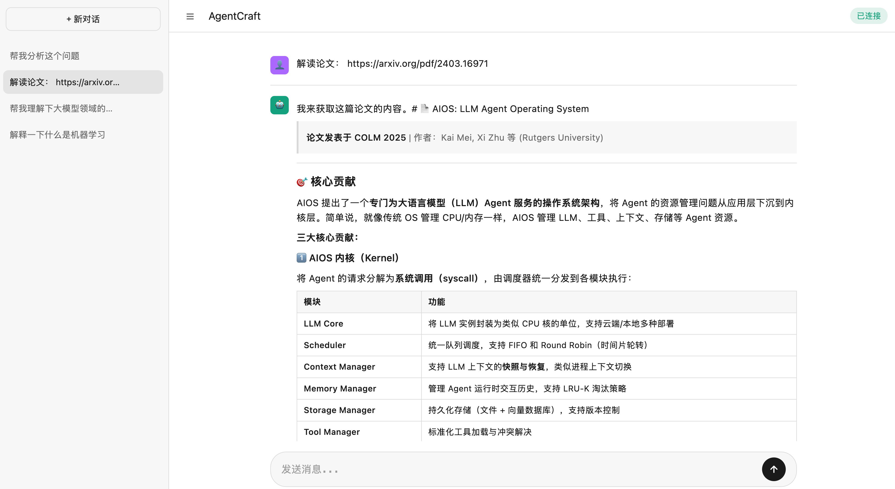

# AgentCraft

AI Agent with LLM and tools.



## 快速启动

```bash
# 1. 安装依赖 (自动创建 .venv)
uv sync

# 2. 配置环境变量
cp ".env copy" .env
# 编辑 .env 填入你的 API Key

# 3. 启动服务
uv run python run_app.py
```

服务将在 http://127.0.0.1:8000/canvas 启动。

## 环境变量

| 变量 | 说明 |
|------|------|
| `LLM_API_KEY` | LLM API 密钥 |
| `DEEPSEEK_API_KEY` | DeepSeek API 密钥 |
| `MLFLOW_TRACKING_URI` | MLflow 追踪地址 (默认 http://127.0.0.1:5050) |